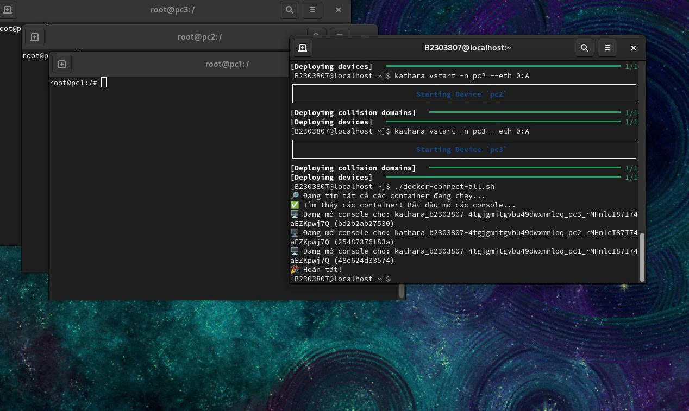

# Install Kathara in CentOS

# Manual
Manual was written by Vietnamese, you can translate to your language, thanks you <3
```bash
# 17/10/2025 (dd/mm/yyyy)
# Tổng hợp: d3nhatv0lam
# Cài Kathara trên CentOS qua docker và pip3 cho người dùng
# Chỉ nên cài vào máy ảo, không khuyến khích thực hiện tại máy thực
# Môi trường thử nghiệm: Window11, VMware, CentOS-9

#### ----- BƯỚC 1: CÀI ĐẶT DOCKER -----
# Phiên bản hoạt động ổn định: Docker 25.0.3-1.el9, kathara==3.7.3, nếu khác phiên bản có thể không chạy
$ sudo dnf install -y dnf-utils
$ sudo dnf config-manager --add-repo https://download.docker.com/linux/centos/docker-ce.repo
$ sudo dnf install -y docker-ce-25.0.3-1.el9 docker-ce-cli-25.0.3-1.el9 containerd.io docker-compose-plugin docker-buildx-plugin
$ sudo systemctl start docker
$ sudo systemctl enable docker
#thêm người dùng vào nhóm docker để khỏi sudo khi làm việc
$ sudo usermod -aG docker $USER
# !!!!!!!!!! SAU ĐÓ, HÃY LOG OUT VÀ LOG IN LẠI !!!!!!!!!!
# Đăng nhập vào docker nếu cần, làm theo hướng dẫn của terminal.
$ sudo docker login
#### ----- BƯỚC 2: CÀI ĐẶT KATHARA -----
# Cài pip
$ sudo dnf install -y python3-pip
# Cài kathara
$ PY_MINOR=$(python3 -c 'import sys; print(sys.version_info.minor)'); if [ $PY_MINOR -ge 10 ]; then echo "Python >= 3.10. Cài đặt Kathara mới nhất..."; pip3 install kathara; else echo "Python <= 3.9. Cài đặt Kathara tương thích..."; pip3 install "kathara==3.7.3"; fi
# Cài đặt Routing cho Kathara
$ sudo docker pull kathara/quagga

#### ----- BƯỚC 3: Cấu hình KATHARA -----
# Đặt tên rút gọn kathara
$ echo "alias kathara='sudo python3 -m kathara'" >> ~/.bashrc
$ source ~/.bashrc
# Cài liên kết môi trường
$ echo 'export PATH=$PATH:/usr/local/bin' >> ~/.bash_profile
$ source ~/.bash_profile
# Kiểm tra kathara
$ kathara --version
$ kathara check
# Cài xterm
$ sudo dnf install xterm -y
# tắt enforce (Hình như không tắt cũng được)
$ sudo setenforce 0

# Script tự mở các máy tính đã cài đặt
# Tạo máy không tự mở console đâu, cảm ơn <3
$ nano docker-connect-all.sh
#dán các lệnh bên dưới vào file docker-connect-all.sh
#---------------------
#!/bin/bash
echo "Đang tìm tất cả các container đang chạy..."
# Lấy danh sách ID của tất cả các container đang chạy
CONTAINER_IDS=$(docker ps -q)
# Kiểm tra xem có container nào đang chạy không
if [ -z "$CONTAINER_IDS" ]; then
    echo "Không tìm thấy container nào đang chạy."
    exit 1
fi
echo "Tìm thấy các container! Bắt đầu mở các console..."
for id in $CONTAINER_IDS; do
    # Lấy tên của container để hiển thị cho thân thiện
    name=$(docker ps --format "{{.Names}}" --filter "id=$id")
    echo "Đang mở console cho: $name ($id)"
    
    gnome-terminal -- bash -c "docker exec -it $id bash; exec bash"
done
#---------------------
# Set quyền chạy script
$ chmod 755 docker-connect-all.sh

#### ----- CHẠY THỬ NGHIỆM -----
# lệnh test
$ kathara vstart -n pc1 --eth 0:A 
$ kathara vstart -n pc2 --eth 0:A
$ kathara vstart -n pc3 --eth 0:A
$ ./docker-connect-all.sh
```