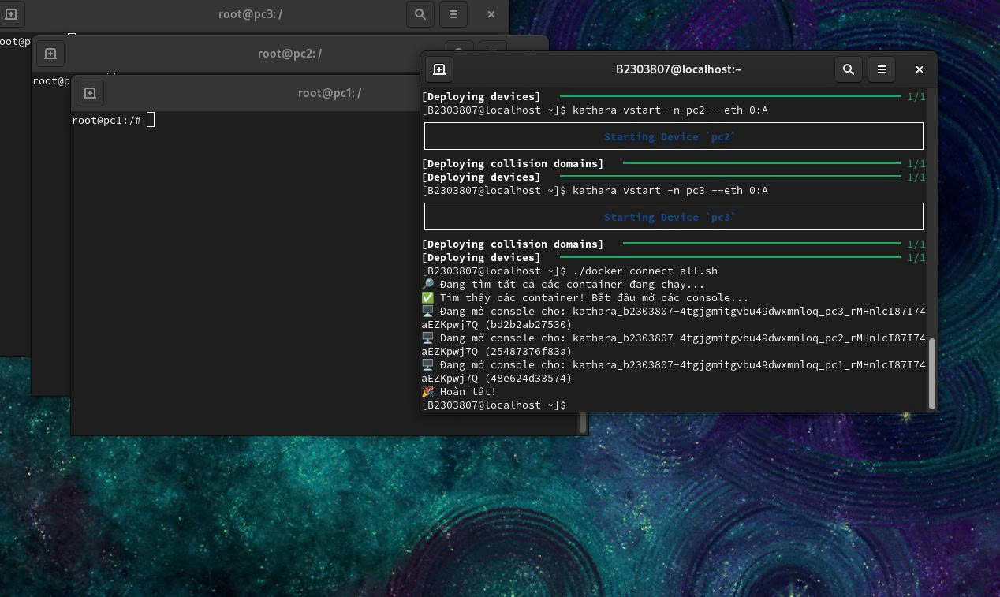
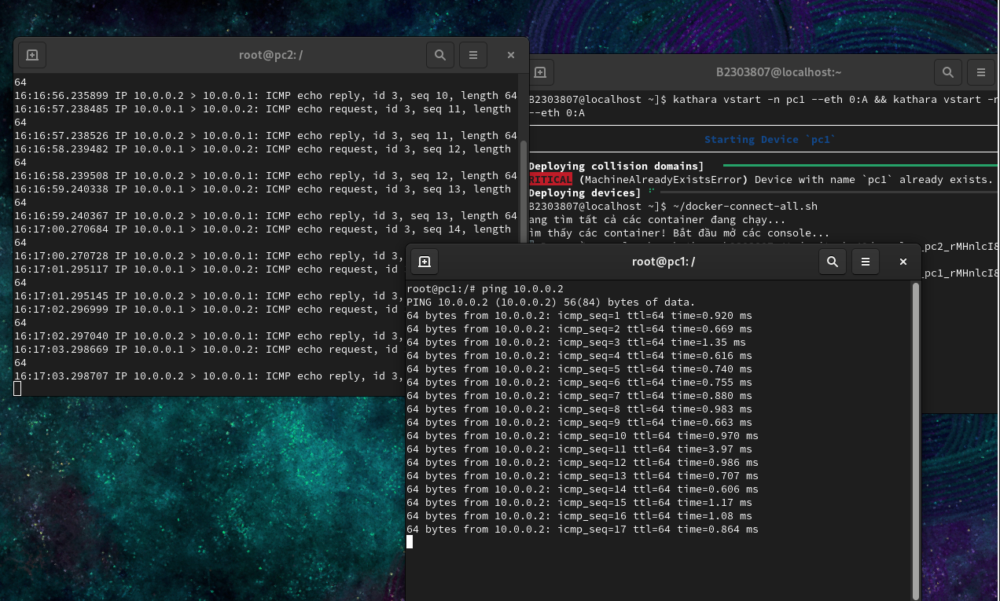
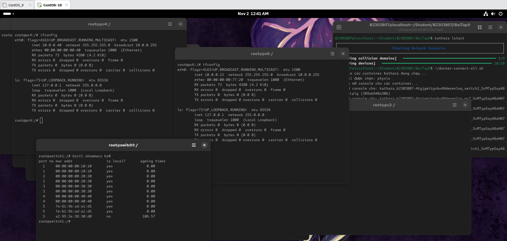
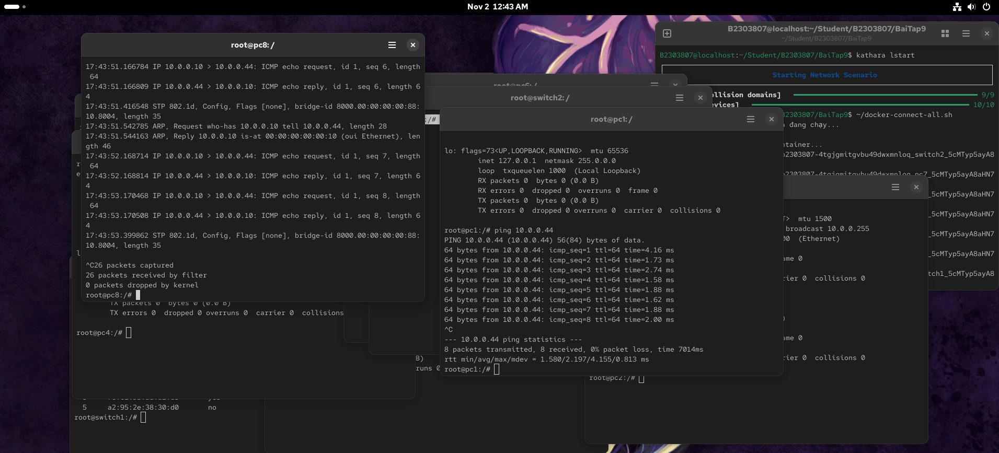

# Install Kathara in CentOS





# Purposes
This manual is used for laboratory work and studying.
# Note
```bash
# Tổng hợp: d3nhatv0lam (Dương Minh Đức)
# Cài Kathara trên CentOS qua docker và pip3
# Chỉ nên cài vào máy ảo trong môi trường thử nghiệm, học tập, chưa có nhiều dữ liệu quan trọng, không khuyến khích thực hiện tại máy thật.
# Môi trường thử nghiệm: VMware CentOS-9 (3 Core, 3GB Ram), VMware CentOS-10 (3 Core, 3GB Ram)
#---
# Compiled by: d3nhatv0lam (Dương Minh Đức)
# Install Kathara on CentOS via Docker and pip3
# This should only be installed on a virtual machine in a testing or learning environment that does not contain important data. It is not recommended to perform this on a physical machine.
# Testing enviroment: VMware CentOS-9 (3 Core, 3GB Ram), VMware CentOS-10 (3 Core, 3GB Ram)
```
# Manual
Manual was written by Vietnamese, you can translate to your language, thanks you <3

## 1. Install Docker
- Tiến hành cài tuần tự:

```bash
$ sudo dnf install -y dnf-utils
$ sudo dnf config-manager --add-repo https://download.docker.com/linux/centos/docker-ce.repo
```

>**Đối với CenOS-9**
>```bash
># Chỉ dành cho CentOS-9
># Phiên bản hoạt động ổn định: Docker 25.0.3-1.el9, kathara==3.7.3, nếu khác phiên bản có thể không chạy
>$ sudo dnf install -y docker-ce-25.0.3-1.el9 docker-ce-cli-25.0.3-1.el9 containerd.io docker-compose-plugin docker-buildx-plugin
>
># Khóa phiên bản docker (Update không bị lỗi phiên bản docker)
>$ sudo dnf install -y python3-dnf-plugin-versionlock
>$ sudo dnf versionlock add docker-ce docker-ce-cli containerd.io docker-buildx-plugin docker-compose-plugin
>$ sudo dnf versionlock list
># Kiểm tra lại nếu đã có docker* thì đã được
>```
>**Đối với CenOS-10**
>```bash
># Chỉ dành cho CentOS-10
>$ sudo dnf install -y docker-ce docker-ce-cli containerd.io docker-compose-plugin docker-buildx-plugin
>```

```bash
# Kích hoạt Docker
$ sudo systemctl start docker
$ sudo systemctl enable docker
# Thêm người dùng vào nhóm docker để không cần sudo docker khi làm việc
$ sudo usermod -aG docker $USER
# !!!!!!!!!! SAU ĐÓ, HÃY LOG OUT VÀ LOG IN LẠI !!!!!!!!!!
# Đăng nhập vào docker, làm theo hướng dẫn của terminal.
$ sudo docker login
```
## 2. Install Kathara
```bash
# Cài xterm
$ sudo dnf install xterm -y
# Cài pip
$ sudo dnf install -y python3-pip
```

>*Cài đặt kathara*
>**Đối với CentOS-9**
>```bash
>$ pip3 install "kathara==3.7.3"
>```
>**Đối với CentOS-10**
>```bash
>$ pip3 install kathara
>```

```bash
# Cài bộ định tuyến ảo
$ sudo docker pull kathara/quagga
```

## 3. Config Kathara
```bash
# Đặt tên rút gọn kathara
$ echo "alias kathara='python3 -m kathara'" >> ~/.bashrc
$ source ~/.bashrc
# Cài liên kết môi trường
$ echo 'export PATH=$PATH:/usr/local/bin' >> ~/.bash_profile
$ source ~/.bash_profile
# Kiểm tra kathara
$ kathara --version
$ kathara check
```

```bash
# Script tự mở các máy tính kathara đã khởi động
# Tạo máy không tự mở console đâu, cảm ơn <3
$ nano ~/docker-connect-all.sh
# Dán các lệnh bên dưới vào file docker-connect-all.sh
#---------------------
#!/bin/bash
echo "Đang tìm các container Kathara đang chạy..."
# Lấy danh sách ID của tất cả các container đang chạy
CONTAINER_IDS=$(docker ps -q --filter "name=kathara_")
# Kiểm tra xem có container nào đang chạy không
if [ -z "$CONTAINER_IDS" ]; then
    echo "Không tìm thấy container Kathara nào đang chạy."
    exit 1
fi
# Chọn terminal để chạy các máy ảo kathara
if command -v gnome-terminal >/dev/null 2>&1; then
    TERMINAL_CMD="gnome-terminal"
elif command -v ptyxis >/dev/null 2>&1; then
    TERMINAL_CMD="ptyxis"
elif command -v xterm >/dev/null 2>&1; then
    TERMINAL_CMD="xterm"
else
    echo "Không tìm thấy terminal nào phù hợp (gnome-terminal, ptyxis, xterm)."
    exit 1
fi

echo "Terminal được chọn: $TERMINAL_CMD"
echo "Bắt đầu mở console cho các container..."

for id in $CONTAINER_IDS; do
    # Lấy tên của container dễ đọc
    name=$(docker ps --format "{{.Names}}" --filter "id=$id")
    echo "Đang mở console cho: $name ($id)"
    
    case "$TERMINAL_CMD" in
        gnome-terminal)
            gnome-terminal -- bash -c "docker exec -it $id bash"
            ;;
        ptyxis | xterm)
            if [ "$TERMINAL_CMD" = "ptyxis" ]; then
                ptyxis -- bash -c "docker exec -it $id bash" &
            else
                xterm -e "docker exec -it $id bash" &
            fi
            # Thêm "sleep" (chờ/nghỉ) để không bị lag
            sleep 0.3
            ;;
    esac
done
#---------------------
# Set quyền chạy script
$ chmod 755 ~/docker-connect-all.sh
```
## 4. Kathara Test
```bash
# Lệnh test
$ kathara vstart -n pc1 --eth 0:A && kathara vstart -n pc2 --eth 0:A
$ ~/docker-connect-all.sh
# pc1: 
$ ifconfig eth0 10.0.0.1/24
# pc2:
$ ifconfig eth0 10.0.0.2/24
$ ping 10.0.0.1
# Clean all
$ kathara wipe
```


